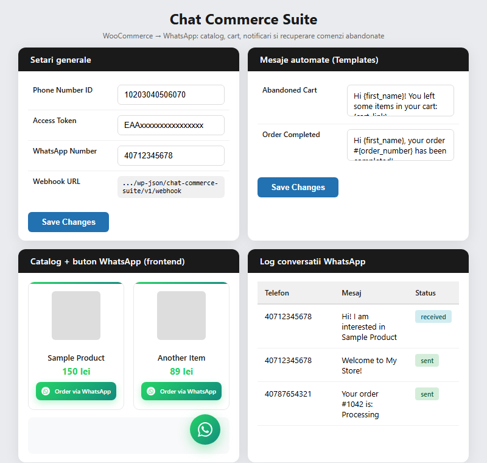

# Chat Commerce Suite

Turn any WooCommerce store into a WhatsApp sales channel. Adds a product catalog, order button, abandoned cart recovery, and automatic order status notifications — all sent through the official WhatsApp Business Cloud API.



## Features

- **Order via WhatsApp button** on every product page, linking straight to a pre-filled chat with your store number.
- **Catalog shortcode** (`[wa_catalog]`) that renders a responsive product grid with WhatsApp ordering built in.
- **Abandoned cart recovery** — automatically messages customers who leave items in their cart after a configurable delay.
- **Order status notifications** sent to customers on hold, processing, completed, and cancelled — fully customizable templates.
- **Two-way webhook** that logs incoming messages and replies to simple commands (`status`, `products`, `contact`).
- **Message log** in the admin area so you can see exactly what was sent and received.
- Clean settings screen under **WooCommerce → WhatsApp Suite**.

## Requirements

- WordPress 5.0+
- WooCommerce 3.0+
- PHP 7.2+
- A WhatsApp Business Cloud API app (Phone Number ID + access token) from Meta for Developers

## Installation

1. Download or clone this repository into `wp-content/plugins/chat-commerce-suite`.
2. Activate **Chat Commerce Suite** from the WordPress Plugins screen.
3. Go to **WooCommerce → WhatsApp Suite** and enter your Phone Number ID, access token, and a verify token of your choice.
4. In your Meta app, set the webhook Callback URL to:
   ```
   https://yourdomain.com/wp-json/chat-commerce-suite/v1/webhook
   ```
   and use the same verify token you configured in step 3.

## Usage

### Product page button

Enabled automatically after activation — no setup required beyond adding your WhatsApp number in **General** settings.

### Catalog shortcode

```
[wa_catalog columns="3" limit="12" category="shoes"]
```

| Attribute  | Default | Description                          |
|------------|---------|---------------------------------------|
| `columns`  | `3`     | Number of grid columns (2, 3, or 4)   |
| `limit`    | `-1`    | Max products to display (`-1` = all)  |
| `category` | —       | Restrict to a product category slug   |

### Message templates

Editable under **Message Templates**, with placeholders:

```
{first_name} {last_name} {order_number} {cart_link} {order_total}
```

## Configuration reference

| Setting            | Location                          |
|---------------------|-----------------------------------|
| API credentials      | General                          |
| Webhook verify token | General                          |
| Abandoned cart delay | Abandoned Cart                   |
| Notification statuses| Order Notifications              |
| Catalog appearance   | Catalog                          |
| Message history       | Logs                             |

## License

GPL-2.0-or-later. See [LICENSE](https://www.gnu.org/licenses/gpl-2.0.html) for details.
